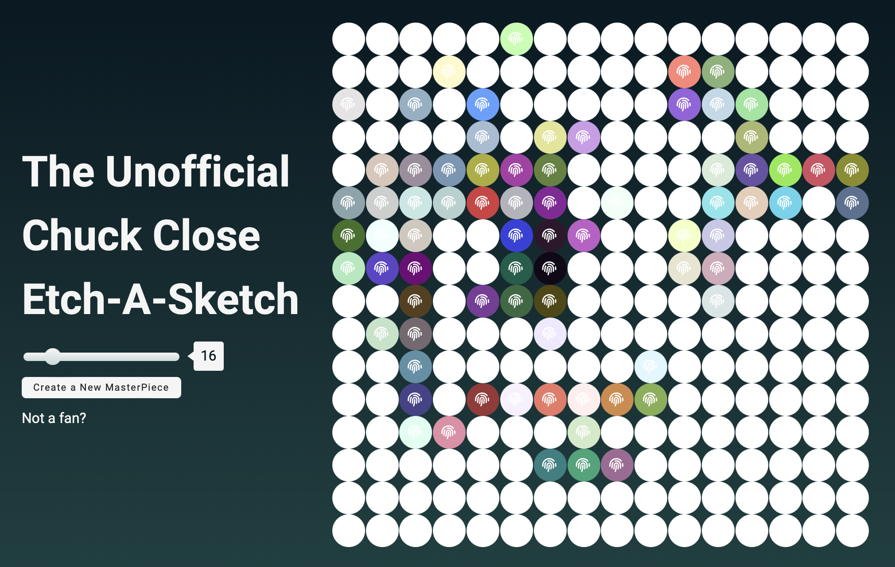
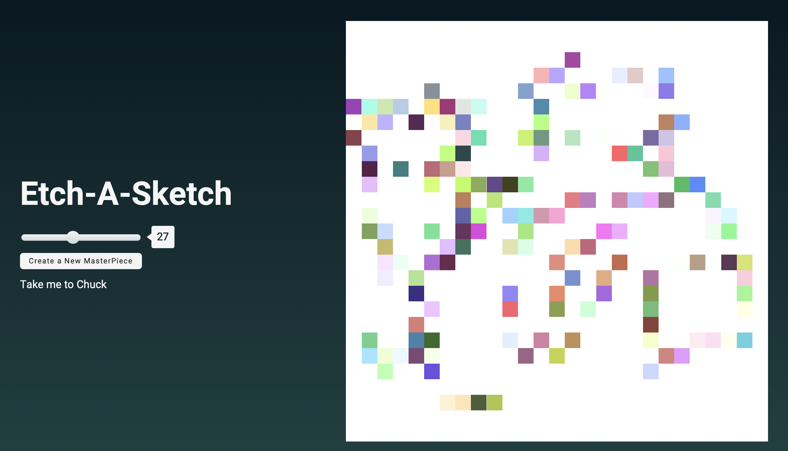

# Odin Project Etch-A-Sketch

##Features

Resizing window resizes the canvas, but keeps any progress. 

Two views: Chuck close and regular Etch-A-Sketch. 

Colors darken by 10% with every pass. 

##Screenshots

##Link

[Live](https://moosecowbear.github.io/odin-project-etch-a-sketch/)
